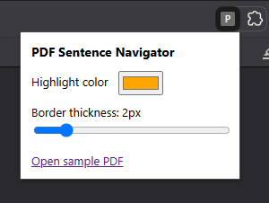
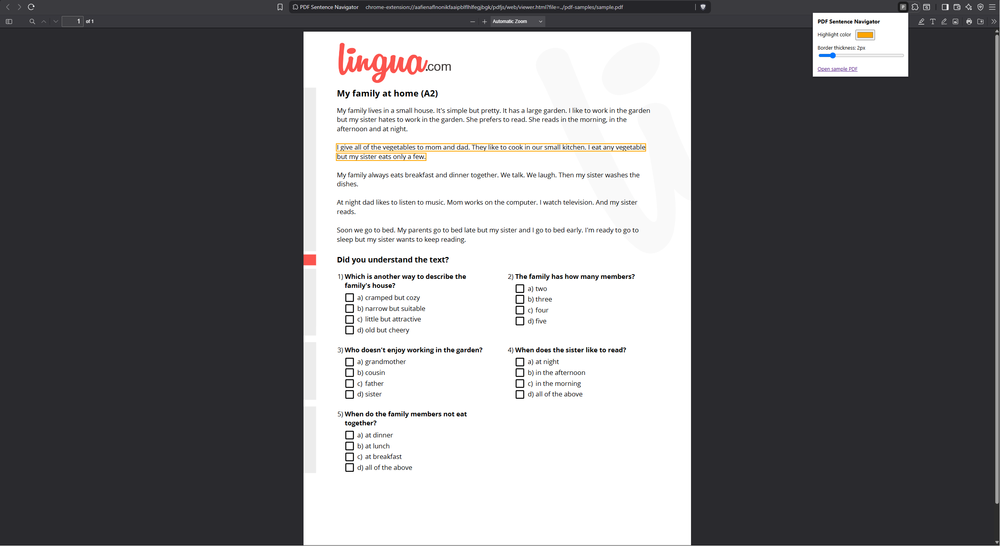

# PDF Sentence Navigator

PDF Sentence Navigator is a Chrome Extension that opens PDFs in an extension-hosted PDF.js viewer and lets users navigate through PDF text with keyboard shortcuts.

The extension highlights the currently active sentence or sentence-like text group and allows users to move forward and backward through the PDF using `Tab` and `Shift + Tab`.

PDFs can be opened from the included sample PDF, from the current online PDF tab, or from a local PDF selected through the popup.

This project was built for a Chrome Extension assignment using Manifest V3.

## Features

- Opens PDFs in an extension-hosted PDF.js viewer
- Opens the included sample PDF
- Opens the current online PDF tab in the extension viewer
- Opens local PDFs selected from the popup
- Navigates forward through sentence groups with `Tab`
- Navigates backward through sentence groups with `Shift + Tab`
- Starts navigation from the currently visible PDF text when no sentence is active
- Highlights the active sentence group inside the PDF
- Clears the active highlight with `Escape`
- Clears the active highlight when the user clicks inside the document
- Supports long PDFs by working with PDF.js lazy rendering
- Uses layout-aware grouping to reduce very large highlighted chunks
- Includes popup settings for highlight color and border thickness
- Includes a reset option for restoring default highlight settings
- Runs locally in the browser without sending PDF text to an external server

## Screenshots

### Popup Settings

### Sentence Highlighting

## How It Works

The extension uses an extension-hosted PDF.js viewer instead of Chrome's native PDF viewer.

PDF.js renders selectable PDF text into text-layer spans. The extension reads the visible text spans from the PDF.js text layer, sorts them into visual reading order, groups them into sentence-like chunks, and highlights the active group during keyboard navigation.

The extension does not split or rewrite PDF.js text spans. PDF.js controls the position and layout of those spans, so modifying them directly can break text rendering. Instead, the extension only adds and removes a CSS highlight class from the original PDF.js text spans.

For remote online PDFs, the popup sends the current PDF URL to the extension background service worker. The background worker fetches the PDF bytes, stores them temporarily, and opens the PDF.js viewer with a temporary `pdfDataId`. The viewer then loads the PDF data locally through `pdf-data-loader.js`.

For local PDFs, the popup file picker reads the selected PDF and uses the same `pdfDataId` loading flow.

## Opening PDFs

The popup provides three ways to open PDFs:

- **Open sample PDF** opens an included sample PDF from the extension.
- **Open current PDF** opens the PDF from the active online PDF tab in the extension viewer.
- **Choose local PDF** lets the user select a PDF from their computer.

Remote online PDFs are fetched by the extension background service worker and loaded into the PDF.js viewer as local PDF data. This fetch is user-initiated (it only runs when the user clicks **Open current PDF**) and uses the extension host permissions. The background fetch may include existing site cookies when the original PDF host requires them to serve the file. This avoids direct remote loading issues with PDF.js same-origin checks and cross-origin restrictions.

**Open current PDF** detects obvious PDF URLs, such as URLs ending in `.pdf`, so PDFs served from URLs without `.pdf` may not be detected.

Local `file://` PDF tabs are not supported by **Open current PDF**. To open a PDF from your computer, use **Choose local PDF** instead.

Local PDFs are supported through the file picker, but the current picker is limited to PDFs under 15 MB.

## Sentence Grouping

Sentence groups are created from the PDF.js text layer.

The extension groups text spans together until it detects either:

- a real sentence-ending punctuation mark
- a page boundary
- a large vertical gap that looks like a paragraph break
- a short heading-like line before smaller body text

The sentence-ending logic includes checks for common cases such as abbreviations, decimals, URLs, and email addresses so that periods in text like `Dr.`, `e.g.`, `3.14`, or `example.com` are not always treated as sentence endings.

## Keyboard Controls

| Shortcut      | Action                              |
| ------------- | ----------------------------------- |
| `Tab`         | Move to the next sentence group     |
| `Shift + Tab` | Move to the previous sentence group |
| `Escape`      | Clear the active highlight          |
| Mouse click   | Clear the active highlight          |

## Highlight Settings

The extension popup includes controls for changing the highlight color and border thickness.

Settings are saved locally with `chrome.storage.local`, so they stay available after refreshing or reopening the PDF viewer.

The popup also includes a reset button to restore the default highlight color and border thickness.

## Installation

1. Clone or download this repository.
2. Open Google Chrome.
3. Go to `chrome://extensions`.
4. Turn on **Developer mode**.
5. Click **Load unpacked**.
6. Select the project folder.
7. Click the extension icon.
8. Use the popup to open a sample PDF, open the current online PDF tab, or choose a local PDF.

## Testing

The project can be tested with the included sample PDF, online PDFs, or local PDFs.

Recommended test cases and expected behavior:

- a short normal text PDF — should work normally
- a long book PDF — should continue navigating as PDF.js lazily renders more pages
- a PDF with headings and paragraphs — should create smaller sentence-like groups using layout-aware grouping
- a PDF with bullet points or numbered lists — should work, though grouping may vary depending on the PDF text layer
- a two-column article or research paper — may not follow perfect reading order; this is a known limitation
- a scanned/image-only PDF — expected not to work unless it contains selectable/OCR text
- an online PDF opened through **Open current PDF** — should open in the extension viewer if the PDF URL is detected and accessible
- a local PDF opened through **Choose local PDF** — should work for PDFs under 15 MB

To test navigation, open a PDF in the extension viewer and use `Tab` / `Shift + Tab` to move through the highlighted sentence groups.

To test popup settings, change the highlight color or border thickness, then confirm the active highlight updates in the PDF viewer. Use the reset button to restore the default settings.

## Test PDFs

The `pdfjs/pdf-samples/` folder contains a small sample PDF used for quick testing.

During development, the extension was also tested with long PDFs, heading-heavy PDFs, two-column PDFs, scanned/image-only PDFs, remote online PDFs, and local PDFs selected through the popup.

Scanned/image-only PDFs are expected not to work unless they contain selectable OCR text.

## Privacy

All PDF text processing happens locally in the browser.

The extension does not send PDF text, document content, or navigation data to an external server.

## Known Limitations

- Scanned or image-only PDFs are not supported unless the PDF contains selectable/OCR text.
- Multi-column PDFs may not always follow perfect reading order.
- Highlighting is based on PDF.js text spans, so a highlight may sometimes include nearby text when a sentence boundary occurs inside a single span.
- Sentence detection is heuristic-based and may not be perfect for every PDF.
- Local PDFs chosen with **Choose local PDF** are limited to under 15 MB because the picker passes PDF bytes through extension messaging.
- Local `file://` PDF tabs are not supported by **Open current PDF**; use **Choose local PDF** to open a PDF from your computer instead.
- **Open current PDF** only detects obvious PDF URLs, such as URLs ending in `.pdf`, so PDFs served from URLs without `.pdf` may not be detected.
- Viewer tabs opened through the remote/local `pdfDataId` handoff may not reload correctly after a page refresh, because the temporary PDF data is used once and then released.
- Password-protected, login-gated, or bot-protected online PDFs may fail if the background fetch cannot access the PDF data.

## Tech Stack

- JavaScript
- HTML
- CSS
- Chrome Extension Manifest V3
- PDF.js

## Future Improvements

Planned or possible improvements include:

- Add popup settings for grouping sensitivity
- Improve reading order for multi-column PDFs
- Improve partial sentence highlighting when sentence boundaries occur inside a single PDF.js text span
- Improve support for larger local PDFs without passing large byte arrays through extension messaging
